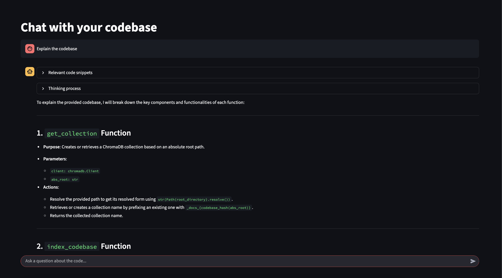

# `local-cursor` - Local AI-Powered Python Codebase Assistant



When I'm traveling on a plane, there isn't a way for my to prompt my codebase with Cursor due to no internet.
But what if I could chat with my codebase locally? 

Introducing `local-cursor`, a chatbot indexed to your codebase that runs completely locally! 

The app indexes your code using vector embeddings and allows you to ask questions about your codebase, getting intelligent responses powered by local LLMs and relevant code snippets as context.

## Features

- **Local, no internet needed**: Runs entirely locally using Ollama models.
- **Retrieval-Augmented Generation (RAG)**: Uses a RAG to add relevant code context to an LLM query.
- **Semantic Code Search**: Uses vector embeddings to understand code context and meaning.
- **Smart Code Chunking**: Intelligently splits Python files into meaningful chunks.
- **macOS Native Integration**: Native folder picker for easy codebase selection.
- **Real-time Streaming**: See the AI's reasoning process as it generates responses, for better UX and a faster response to the user.

## What I Learned

Coming into this, I had very little understanding about ANYTHING in AI field. The max I could do a API call to for a GPT model and learning how to trick ChatGPT to swear via base64 encoding & decoding. 
Inspired by understanding how the AI tool I use the most (Cursor) work, I decided to learn concepts used in AI apps by building out the feature I find the most useful: codebase indexing, and how it works for querying the codebase.

Key concepts I learned:

### RAG (Retrieval-Augmented Generation)
RAGs work by fetching context related to an LLM query, and appending that context to the query.
This is done via vector embeddings (turning query into a vector) and similarity search (fetching context that is vector similar to the query).
### Vector embeddings and similarity search
During the indexing process, the code chunks get embedded into vectors and stored in a vector database. 
Relevant context for the query can be fetched by embedding the query into a vector, and doing a similarity search.
Similarity search works by calculating the distance (such as by Euclidean distance, or vector similarity), and then selecting `k` nearest vectors. In other words, K Nearest Neighbors (k-NN).
### UX
When I first built this, the user experience of waiting for a response from the chatbot felt very slow, and I thought it was an issue with my computer of the app freezing while I waited.
However, I then realized this is exactly why LLMs stream their thinking process to the user! Being able *see* some sort immediate feedback makes the program feel faster and avoids them thinking the app is frozen, and so I then implemented the feature of streaming the thinking process to the user.
### Code Chunking
This app uses LlamaIndex's CodeSplitter to break the files into semantically meaningful chunks. Why use chunking? Because otherwise the text would be too long for the model to vectorize, AND because converting the entire code file into only 1 vector means you lose granular meaning inside the code file.
### Local LLM integration
I learned how to run an LLM locally via ollama, and how larger parameter sized models are much slower to run.

## Next Steps

A current limitation of this project is that it only analyzes Python codebases, but what if you have a codebase with multiple languages?
To fix this, I can generalize the `chunk_python_code()` into `chunk_code(language)`, where if a file has a `.rs` suffix then `chunk_code("RUST")` gets called, and likewise with `.py` files calling `chunk_code("PYTHON")`.

## Flow of How it Works

1. **Selecting Codebase**: The user is able to use macOS's native folder picker to select the codebase's folder. This is possible thanks to AppleScript integration with Streamlit

2. **Code Indexing**: The app recursively scans your Python codebase for .py files. Thi

3. **Chunking**: For each of the Python files, the app uses LlamaIndex's CodeSplitter to break the files into semantically meaningful chunks. Why use chunking? Because otherwise the text would be too long for the model to vectorize, AND because converting the entire code file into only 1 vector means you lose granular meaning inside the code file.

Initially, I approached chunking by turning each function into a chunk. But for large functions, this still isn't granular enough resulting in vectors that aren't as meaningful. My intuiton lead me to wanting to chunk code files not only by each function, but also additional vectors for the logic inside of the function.

I eventually stumbled upon this blogpost by sweep.dev, where there was a `CodeSplitter` implementation in the LlamaIndex library for code chunking.
https://web.archive.org/web/20240413093103/https://docs.sweep.dev/blogs/chunking-2m-files

4. **Vector Embeddings**: Each code chunk is converted to vector embeddings using the `mxbai-embed-large` model via Ollama

5. **Vector Storage**: Embeddings are stored in a ChromaDB vector database for fast similarity search

6. **Semantic Search**: When you ask a question, it's embedded and compared against stored code chunks to find the most relevant context.

7. **LLM Query With Context**: The relevant code snippets are sent to the `deepseek-r1:1.5b` model to generate a response. I streamed the LLM's thinking process to the user for a more responsive UX.

## Prerequisites

- **macOS** (currently required for the native folder picker)
- **Python 3.9+**
- **Ollama** installed and running locally

### Required Ollama Models

You'll need to pull these models before using the app:

```bash
# For embeddings
ollama pull mxbai-embed-large

# For chat responses  
ollama pull deepseek-r1:1.5b
```

## Installation

1. **Clone the repository**:
   ```bash
   git clone <repository-url>
   cd codebase-indexing
   ```

2. **Install Python dependencies**:
   ```bash
   pip install -r requirements.txt
   ```

3. **Install and start Ollama**:
   ```bash
   # Install Ollama (if not already installed)
   curl -fsSL https://ollama.ai/install.sh | sh
   
   # Start Ollama service
   ollama serve
   ```

4. **Pull required models**:
   ```bash
   ollama pull mxbai-embed-large
   ollama pull deepseek-r1:1.5b
   ```

## Usage

1. **Start the application**:
   ```bash
   streamlit run app.py
   ```

2. **Select your codebase**:
   - Click "Browse for Folder" in the sidebar
   - Select your Python project directory
   - The app will automatically index your codebase

3. **Start chatting**:
   - Ask questions about your code in natural language
   - Examples:
     - "How does the authentication system work?"
     - "Where is the database connection handled?"
     - "What does the `chunk_python_code` function do?"
     - "Show me all the error handling patterns"

4. **View results**:
   - See relevant code snippets in the expandable section
   - Watch the AI's thinking process in real-time
   - Get comprehensive answers based on your actual code

## Use Cases

- **Code Understanding**: Quickly understand how large codebases work
- **Feature Location**: Find where specific functionality is implemented
- **Code Review**: Get explanations of complex code sections
- **Documentation**: Generate explanations for undocumented code
- **Debugging**: Understand error patterns and code flow

## Limitations

- Currently only supports **macOS** (due to native folder picker)
- Currently indexes **Python files** (`.py` extension). This is addressed in the Next Steps section, earlier in this readme.
- Requires **Ollama** to be running locally, and a computer that can run the LLM.
